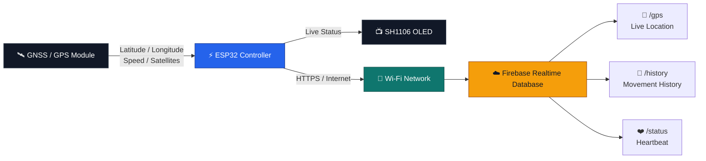
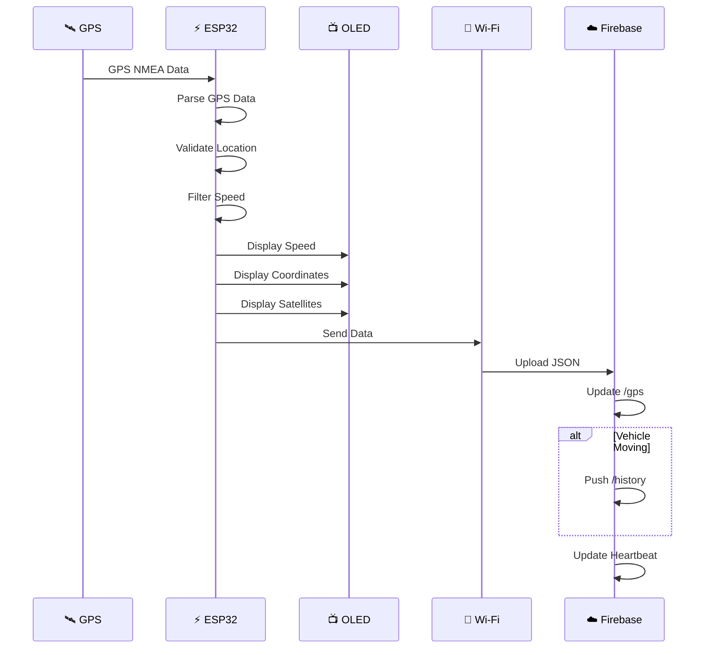
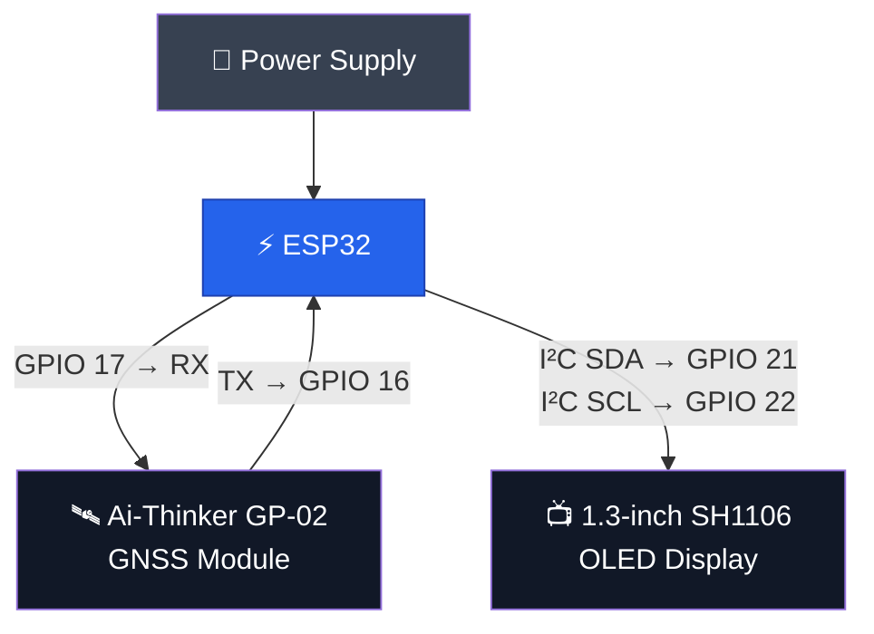
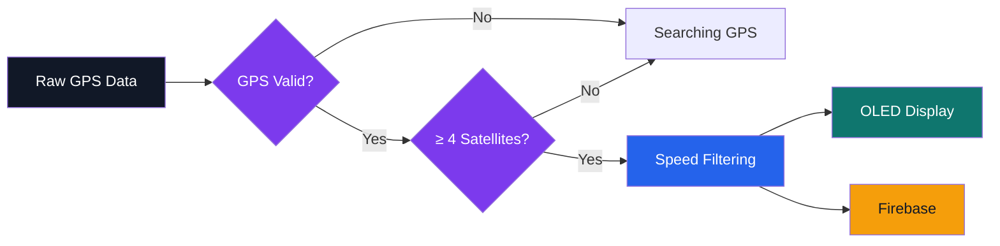

# 🚗 Vehicle Tracking System

<div align="center">


### 🚘 Real-Time IoT Vehicle Monitoring System

**ESP32 • GPS/GNSS • OLED • Wi-Fi • Firebase Realtime Database**

<br>


</div>

---

## 🌟 Overview

**Vehicle Tracking System** is an IoT-based embedded tracking solution designed to monitor a vehicle's position and movement in real time.

The system uses an **ESP32** as the central controller. A **GNSS/GPS module** provides location and speed information, while an **SH1106 OLED display** provides real-time local feedback.

Through Wi-Fi, the ESP32 communicates with **Firebase Realtime Database**, where live GPS information, movement history, and system heartbeat data are stored.

### 🎯 Core Capabilities

| Feature                  | Description                          |
| ------------------------ | ------------------------------------ |
| 📍 Live Location         | Real-time latitude and longitude     |
| 🚗 Speed Monitoring      | GPS-based vehicle speed              |
| 🛰️ Satellite Monitoring | Current GPS satellite count          |
| 📺 OLED Dashboard        | Local real-time vehicle status       |
| ☁️ Cloud Storage         | Firebase Realtime Database           |
| 🧭 Movement History      | Stores location history while moving |
| ❤️ Heartbeat             | Device communication monitoring      |
| 🔄 Auto Reconnection     | Firebase network reconnection        |

---

# 🧠 System Architecture



---

# 🔄 Real-Time Data Flow



---

# 🔌 Hardware Architecture



---

# 📡 Communication Architecture

```text
┌─────────────────────────────────────────────────────────────┐
│                     VEHICLE SYSTEM                         │
├─────────────────────────────────────────────────────────────┤
│                                                             │
│   🛰️ GPS/GNSS                                               │
│        │                                                    │
│        │ UART                                               │
│        ▼                                                    │
│   ⚡ ESP32 ──────────────── I²C ───────────────► 📺 OLED   │
│        │                                                    │
│        │ Wi-Fi                                              │
│        ▼                                                    │
│   📡 Internet                                                │
│        │                                                    │
│        ▼                                                    │
│   ☁️ Firebase Realtime Database                             │
│        │                                                    │
│        ├──────────► 📍 Live GPS                             │
│        │                                                    │
│        ├──────────► 🧭 Movement History                     │
│        │                                                    │
│        └──────────► ❤️ Device Heartbeat                     │
│                                                             │
└─────────────────────────────────────────────────────────────┘
```

---

# 📊 Firebase Data Architecture

The system uses a simple and scalable Firebase structure:

```text
/
├── gps
│   ├── lat
│   ├── lng
│   ├── speed
│   ├── sats
│   └── timestamp
│
├── history
│   ├── record_001
│   │   ├── lat
│   │   ├── lng
│   │   ├── speed
│   │   ├── sats
│   │   └── timestamp
│   │
│   ├── record_002
│   └── ...
│
└── status
    └── heartbeat
```

### Example Live GPS Object

```json
{
  "lat": 23.810331,
  "lng": 90.412521,
  "speed": 25.4,
  "sats": 8,
  "timestamp": 1727000000000
}
```

---

# 📺 OLED Interface

The OLED provides a compact real-time dashboard.

### GPS Searching

```text
┌────────────────────────┐
│ VEHICLE TRACKING       │
│────────────────────────│
│ Searching GPS...       │
│ Waiting for fix        │
│                        │
│ Satellites: 3         │
└────────────────────────┘
```

### GPS Fixed

```text
┌────────────────────────┐
│      25.4 km/h         │
│────────────────────────│
│ Lat: 23.810331         │
│ Lng: 90.412521         │
│ Sats: 8                │
└────────────────────────┘
```

---

# 🧠 Intelligent GPS Processing

The ESP32 does not blindly upload every GPS reading.

The system performs several processing steps:



---

# 🚗 Speed Filtering

GPS modules can sometimes report very small speeds even when the vehicle is stationary.

To reduce unnecessary movement detection:

```cpp
if (rawSpeed < 3.0) {
    filteredSpeed = 0.0;
}
```

Therefore:

```text
Raw Speed < 3 km/h
        ↓
Considered Stationary
        ↓
Filtered Speed = 0 km/h
```

This also prevents unnecessary history records when the vehicle is effectively stopped.

---

# ⏱️ Cloud Update Strategy

The ESP32 updates Firebase every **2 seconds**.

```text
GPS Reading
     ↓
Process Data
     ↓
OLED Update
     ↓
2 Second Interval
     ↓
Firebase Update
     ├── /gps
     ├── /history   → Only when moving
     └── /status/heartbeat
```

---

# 🔌 Pin Configuration

### GPS — UART2

| GPS Pin   | ESP32 Pin |
| --------- | --------- |
| TX        | GPIO 16   |
| RX        | GPIO 17   |
| Baud Rate | 9600      |

### OLED — I²C

| OLED Pin | ESP32 Pin |
| -------- | --------- |
| SDA      | GPIO 21   |
| SCL      | GPIO 22   |
| VCC      | 3.3V      |
| GND      | GND       |
| Address  | `0x3C`    |

---

# 🛠️ Technology Stack

<div align="center">

| Layer           | Technology                 |
| --------------- | -------------------------- |
| Microcontroller | ESP32                      |
| Programming     | C / C++                    |
| Positioning     | GNSS / GPS                 |
| Display         | SH1106 OLED                |
| Communication   | UART / I²C                 |
| Network         | Wi-Fi                      |
| Cloud           | Firebase Realtime Database |
| Development     | Arduino IDE                |

</div>

---

# 📚 Libraries

```cpp
#include <WiFi.h>
#include <Firebase_ESP_Client.h>
#include <addons/TokenHelper.h>
#include <TinyGPS++.h>
#include <HardwareSerial.h>
#include <Wire.h>
#include <Adafruit_GFX.h>
#include <Adafruit_SH110X.h>
```

### Required Libraries

* `Firebase ESP Client`
* `TinyGPS++`
* `Adafruit GFX`
* `Adafruit SH110X`
* ESP32 Board Package

---

# 🚀 Installation

## 1. Clone Repository

```bash
git clone https://github.com/mdmirajhossansajid/Vehicle-Tracking-System.git
```

## 2. Open Arduino Project

Open:

```text
ESP32/vehicle_tracking.ino
```

using Arduino IDE.

## 3. Install Dependencies

Install the required libraries through:

```text
Arduino IDE
→ Sketch
→ Include Library
→ Manage Libraries
```

## 4. Configure Wi-Fi

```cpp
#define WIFI_SSID "YOUR_WIFI_SSID"
#define WIFI_PASSWORD "YOUR_WIFI_PASSWORD"
```

## 5. Configure Firebase

```cpp
#define DATABASE_URL "YOUR_FIREBASE_DATABASE_URL"
#define API_KEY "YOUR_FIREBASE_API_KEY"
```

## ⚠️ Security

**Never commit real Wi-Fi passwords or private credentials to a public repository.**

For GitHub, keep placeholders such as:

```cpp
#define WIFI_PASSWORD "YOUR_WIFI_PASSWORD"
#define API_KEY "YOUR_FIREBASE_API_KEY"
```

---

# 📁 Project Structure

```text
Vehicle-Tracking-System/
│
├── ESP32/
│   └── vehicle_tracking.ino
│
├── Hardware/
│   └── pin-configuration.md
│
├── Firebase/
│   └── database-structure.md
│
├── README.md
│
└── .gitignore
```

---

# ⚙️ Main Functional Modules

```text
┌───────────────────────────────────────────┐
│          VEHICLE TRACKING SYSTEM          │
├───────────────────────────────────────────┤
│                                           │
│  🛰️ GPS Acquisition                       │
│       ↓                                   │
│  🧠 GPS Validation                        │
│       ↓                                   │
│  🚗 Speed Processing                      │
│       ↓                                   │
│  📺 OLED Visualization                    │
│       ↓                                   │
│  📡 Wi-Fi Communication                   │
│       ↓                                   │
│  ☁️ Firebase Cloud Storage                │
│       ↓                                   │
│  🧭 Movement History                      │
│                                           │
└───────────────────────────────────────────┘
```

---

# 🎯 Project Objectives

* Develop a real-time GPS vehicle tracking system.
* Process GNSS data using ESP32.
* Monitor vehicle speed and satellite availability.
* Display live information through an OLED.
* Transmit tracking data through Wi-Fi.
* Store live location data in Firebase.
* Maintain movement history.
* Implement a lightweight embedded IoT monitoring architecture.

---

# 🔮 Future Improvements

The system can be extended with:

* 🗺️ Interactive live map
* 📍 Route visualization
* 📏 Total distance calculation
* 🚨 Overspeed alerts
* 🔔 Geofencing
* 📱 Android/iOS application
* 📊 Trip analytics
* 🔐 Improved authentication
* 🔋 Battery monitoring
* 📡 Offline data buffering
* 🚘 Multiple vehicle support

---

# 🏆 Project Highlights

```text
                ┌──────────────────┐
                │   REAL-TIME GPS  │
                └────────┬─────────┘
                         │
             ┌───────────┴───────────┐
             │                       │
             ▼                       ▼
       📺 LOCAL MONITORING      ☁️ CLOUD STORAGE
             │                       │
             ▼                       ▼
        OLED DISPLAY          FIREBASE RTDB
                                     │
                         ┌───────────┴───────────┐
                         │                       │
                         ▼                       ▼
                    📍 LIVE DATA          🧭 HISTORY
```

---

# 👨‍💻 Author

### Md. Miraj Hossan Sajid

**Computer Science & Engineering**
**Southeast University**

**GitHub:** `mdmirajhossansajid`
**LinkedIn:** `mdmirajhossansajid`
**Codeforces:** `Paradoxical_Sajid`

---

<div align="center">

### 🚗 Built with ESP32 • GPS • Firebase • C/C++

**Real-Time Tracking • Embedded IoT • Cloud Connectivity**


</div>
